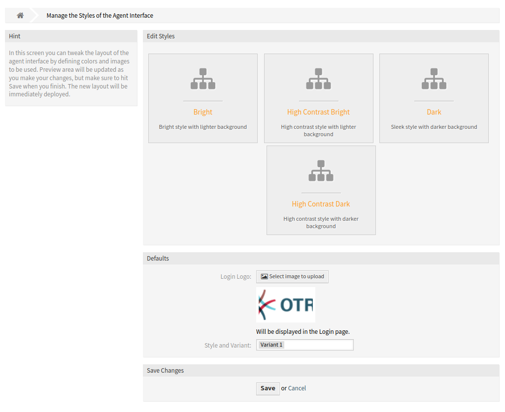
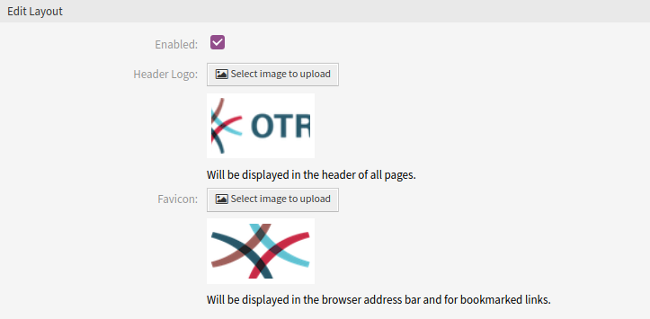
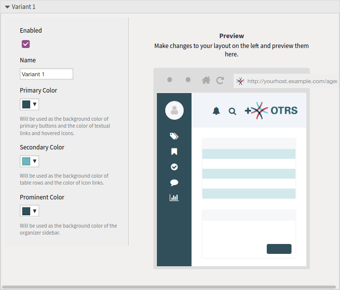

Styles
======

Use this screen to manage styles and choose style variants for use in agent interface. A fresh OTRS installation already contains some variants by default. The style management screen is available in the *Styles* module of the *Agent Interface* group.

   Agent Style Management Screen

The management screen consists of two widget. In the *Edit Styles* widget can be selected the styles for editing. The *Defaults* widget defines, which variant will be used as default for the agent interface. The agents can override this setting and they can select a different variant in they personal preferences, but they can not edit the styles.

Manage Styles
-------------

Styles are grouped into four categories: *Bright*, *High Contrast Bright*, *Dark* and *High Contrast Dark*.

To edit a style, select a category first. The edit screen will be opened for the selected category.

The *Edit Layout* section is the same for all categories.

   Agent Style Layout Edit Screen

The following settings are available when adding or editing this resource.

Enable
   Select whether the style is available for agents.

Header Logo
   The logo is a small image that is displayed in the header of all pages.

   To change the logo, click on the *Select image to upload* button, and select a new logo image. Recommended file format is PNG.

Favicon
   The `favorite icon <https://en.wikipedia.org/wiki/Favicon>`_ is an icon that is displayed in the URL bar of the web browser.

   To change the favorite icon, click on the *Select image to upload* button, and select a new icon. This is usually a 16×16 pixel image in PNG or ICO format.

Some categories contain different variants. Each variant can be customize in the same manner.

   Agent Style Variant

The following settings are available when adding or editing this resource.

Enable
   Select whether the variant is available for agents.

Name
   The name of this resource. Any type of characters can be entered to this field including uppercase letters and spaces.

Primary Color
   This color will be used as the background color of primary buttons and the color of textual links and hovered icons.

   To change the primary color, just select a new color from the color palette. You can chose from the pre-selected colors or define other colors by choosing it from the color selector or typing the hexadecimal value. The new color will be displayed in the preview widget immediately.

Secondary Color
   This color will be used as the background color of table rows and the color of icon links.

   To change the secondary color, just select a new color from the color palette. You can chose from the pre-selected colors or define other colors by choosing it from the color selector or typing the hexadecimal value. The new color will be displayed in the preview widget immediately.

Prominent Color
   This color will be used as the background color of the organizer sidebar.

   To change the prominent color, just select a new color from the color palette. You can chose from the pre-selected colors or define other colors by choosing it from the color selector or typing the hexadecimal value. The new color will be displayed in the preview widget immediately.
